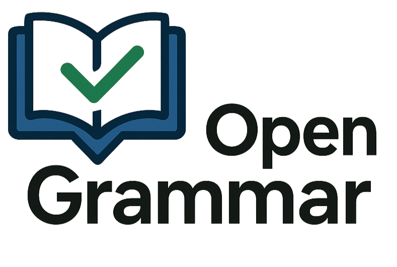
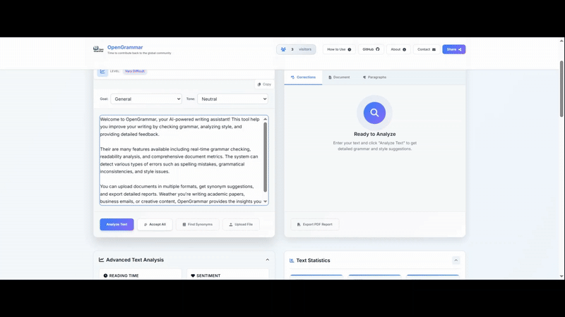

<div align="center">
  

  <h1>🖋️ OpenGrammar</h1>
  <h3>AI-Powered Writing Assistant & Grammar Checker</h3>

  <p>
    <a href="https://edtechtools.me">
      
    </a>
    <a href="https://github.com/muhammadmuneeb007/opengrammar/stargazers">
      
    </a>
    <a href="https://github.com/muhammadmuneeb007/opengrammar">
      
    </a>
    <a href="LICENSE">
      
    </a>
  </p>

  <p><strong>✨ Open source grammar checker powered by AI ✨</strong></p>

  <!-- Video -->
  <video width="800" controls>
    <source src="Video.mp4" type="video/mp4">
    Your browser does not support the video tag.
  </video>

  <br><br>

  <!-- GIF -->
  
</div>

 
---

## 🌟 Features

- 🎯 **Real-time Grammar Checking** - Advanced AI-powered grammar and spelling analysis
- 🎨 **Style Enhancement** - Writing style evaluation and suggestions
- 📊 **Readability Metrics** - Flesch-Kincaid, SMOG, and ARI scores
- 🔤 **Smart Corrections** - Context-aware suggestions with one-click fixes
- 📚 **Synonym Suggestions** - Intelligent word replacement options
- 📈 **Writing Analytics** - Word count, sentence structure, and complexity analysis

---

## 🚀 Quick Start

### 🌐 **Try Online**
Visit **[edtechtools.me](https://edtechtools.me)** to use OpenGrammar instantly!

### 💻 **Local Setup**

**Backend (Flask + Google Gemini AI):**
```bash
cd Backend
python app.py
# Use ngrok for proxy tunnel
```

**Frontend:**
```bash
cd Final
# Open index.html in browser
# Update the ngrok link in modern_grammar_checker_js.js
```

> **Note:** You'll need a Google Gemini API key from Google AI Studio.

---

## 📖 How to Use

1. **Write or paste** your text (up to 10,000 characters)
2. **Click "Check Grammar"** for comprehensive analysis
3. **Review suggestions** with detailed explanations
4. **Accept changes** with one-click corrections

---

## 🤝 Contributing

We welcome contributions! Here's how you can help:

- 🐛 **Report bugs** via [GitHub Issues](https://github.com/muhammadmuneeb007/opengrammar/issues)
- 💡 **Suggest features** 
- 🔧 **Submit code** improvements
- 📝 **Improve documentation**

### Development Setup
```bash
git clone https://github.com/muhammadmuneeb007/opengrammar.git
cd opengrammar
# Follow setup instructions above
```

---

## 📞 Support

- 🌐 **Website**: [edtechtools.me](https://edtechtools.me)
- 💬 **Issues**: [GitHub Issues](https://github.com/muhammadmuneeb007/opengrammar/issues)
- 📧 **Contact**: muneebsiddique007@gmail.com

---

## 📜 License

MIT License - Feel free to use, modify, and distribute!

---

<div align="center">
  
  ### 🌟 **Made with ❤️ for the writing community** 🌟
  
  [](https://edtechtools.me)
  [](https://github.com/muhammadmuneeb007/opengrammar)
  
  *Happy Writing! ✍️*
  
</div>
 ---

## ⭐ Star History

<div align="center">
  
</div>


> **Note:**  
> Thanks to David B. Ascher for providing the opportunity to explore AI stuff. :XD:
